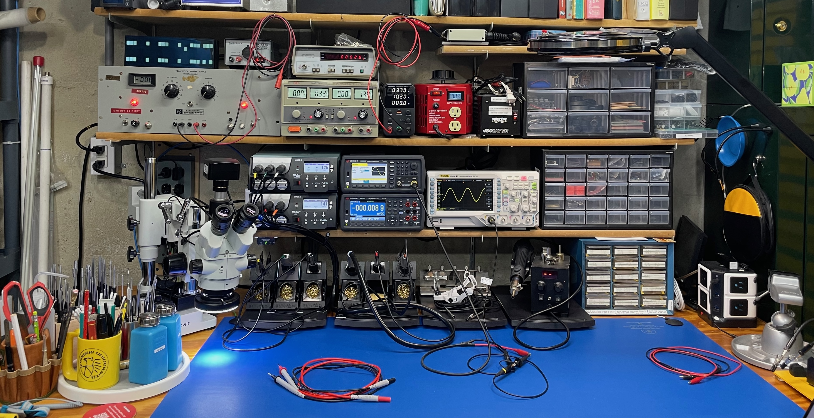
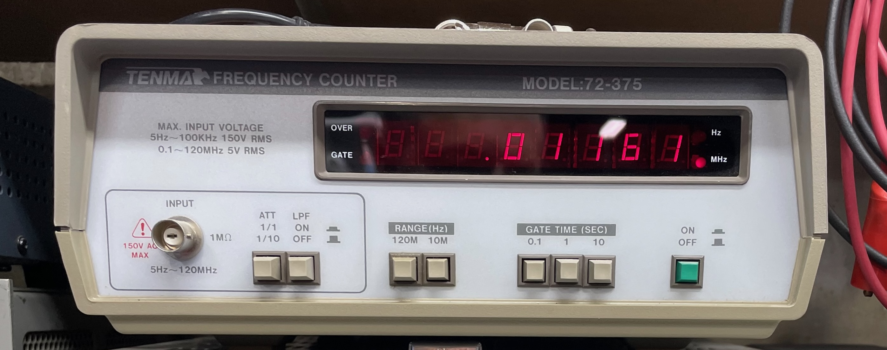

# Doug's Electronics Workshop

To be a Maker, you should have a good workbench setup. Here's a picture of the electronics portion of my workshop. There's a decent amount of equipment here which I've built up over 20 years. It's certainly missing some stuff, but it's a good representation of the tools needed for maker electronics work.

The good news is that being a Maker has gotten quite a bit cheaper, and decent equipment can be had for less money than building a professional lab. I'll run through the major components below. Again, some of my stuff is affordable and some isn't, but I'll try to talk about affordable options.

## Prototyping

While I didn't take pictures, in my parts drawers are protoboards and a variety of hookup wire. 

If you're starting from AdaFruit, Raspberry Pi, ESP32, or Arduino, you won't need much more than a protoboard, wire, a USB cable, and some discrete components to get started.

## Power

Powering your prototypes requires a power supply. If you're using a USB-powered microprocessor from AdaFruit or similar, you often don't need anything else. But for discrete analog and digital circuits or repair of devices, it's helpful to have a supply. My setup is overkill because I've acquired stuff over time.

### DC Power

Let's start off with my first DC power supply. This thing is probably from the 50s or 60s, and I have no memory of how I acquired it. I mostly keep it for nostalgic reasons.

It's a massive, heavy box full of vacuum tubes!! It supplies 0-115 V DC, which is a pretty large range. But it can only supply 1 A, which for most small circuits is fine, but is pretty underpowered by modern power supply standards. The case says it's a "transistor power supply," which I'm guessing means it was used back when transistors were first being developed in the late 50s and early 60s. I've had this since college, and I've upgraded it with a digital volt meter in the top left, a circuit breaker in place of a fuse on the bottom right, and some brighter panel lights.

I'd love to know the history of this.

Let's move to more modern DC power supplies. The two power supplies below represent two vintages. The Mastech supply on the left is powered by a massive transformer and DC rectifier. As you turn the voltage knobs, different circuits switch in with an audible relay click. These circuits pull voltage from a different tap points on the transformer in order to give the desired voltage range. The supply is late 90s or early 2000s. It's a decent supply that can handle several amps. It's also a bit more advanced. You can limit the current supplied in order to test voltage drop out on circuits. And you can chain the two supplies together for double the current or double the voltage. I recently upgraded the voltage potentiometers on this supply to 10-turn pots. This makes it easier to dial in tenths of a volt.

To the right is a generic, cheap switching power supply I bought a year ago from Amazon. It's a direct-from-China no frills supply. It's smaller, but it can supply up to 10 A of current if needed. Switching supplies are the standard design in electronics these days. This cheap supply is the one I use the most. You dial in the voltage you want and press the output button to turn it on. This is what you would get if you're just starting out.

But wait...that small radio shack power supply you might have seen in the bigger photo is a 1980s-90s vintage supply for testing car power accessories (the plug formerly known as the "cigarette lighter".) Yes, I still use this.

### AC Power (and warnings!)

**Please read this section carefully. Working with AC incorrectly can kill you.** DC can kill you too, but not typically the lower voltages we work with in hobby electronics.

Sometimes you need AC power to work on or test an AC device. My setup contains a variable transformer (Variac) plugged into a ground-lifted isolation transformer. The isolation transformer is a 1:1 transformer than separates line AC from output AC. I've modified the isolation transformer so that the ground wire is also not connected between input and output. I'll explain this setup in more detail below. 

To get the voltage I need, I turn on the isolation transformer and turn on the variac and then dial in whatever AC voltage is required for a project. For example, a doorbell camera runs on 18-24 V AC, so if I were working on that, I'd dial the Variac down to that voltage.

**!! Important !!**

Ground wires are meant to provide a safe path for AC to flow if there's ever a short in an appliance. Typically the external metal on the appliance is grounded to prevent electrocution of the user in such a case.

But when you're working on the bench on a 110 V device, and you're using another test device that's also plugged into the mains AC, like an oscilloscope, you can accidentally create a path to AC ground or AC neutral when you're testing. This could fry your scope, or your circuit, or you.

The modified isolation transformer prevents a current path from AC hot on the device you're powering to either neutral or ground on the testing device (like your scope).

Of course, you still have to be careful not to shock yourself when you're working on a high voltage AC circuit, i.e. don't touch any hot sides of the circuit, which makes your body a path to ground.

This is better explained with pictures, so here's an [excellent video](https://www.youtube.com/watch?v=xaELqAo4kkQ&ab_channel=EEVblog) on avoiding this problem from the great folks at EEVBlog.

## Signals & Measurement

My collection is missing a few things here, but I'll document what I have.

### Oscilloscope

Thanks to Rigol, hobbyists with a modest budget can get a decent scope. This is the venerable DS1054Z upgraded to 100 MHz and with all software functions unlocked, the most useful of which is a protocol analyzer (although I usually use my logic analyzer for that these days).

You may not need a scope right away in your maker projects, but eventually you'll want one. When you do, check out Rigol.

### Digital Multimeters

This is an area where I'd like to upgrade. I have a nice industrial Fluke DMM. It works great, and I have no complaints. But a bench top DMM would be better because it would allow logging and lower current measurements for battery-operated applications. I haven't sprung for one, because I want one that measures down into the single µA range.

An industrial DMM is overkill for the beginner hobbyist. Buy a cheaper Fluke like the Fluke 107 if you're getting started. You can safely buy a no-name Chinese DMM, too, but if you want one that lasts forever, buy a Fluke.

While the Fluke 87V can measure capacitors, it's not great for smaller values. For more accurate capacitor readings, and to measure inductors, I have a cheap LCR meter.

I don't do this often, so I didn't spring for a name-brand LCR meter.

Not shown are the many different types of test leads that are useful for meters. My drawers are full of wires. Buy the needle nose test leads if you want to plug them directly into your protoboard for testing.

### Logic Analyzer

Much like Rigol, we have Salae to thank for a relatively affordable logic analyzer. This device is a must if you use Serial, SPI, I2C, I2S, etc. bus communications in your projects. The Rigol scope can do some decoding, so that's a good backup, but nothing beats having this logic analyzer plugged into your laptop.

### Frequency Counter

I haven't had much use for this, but it was giving to me. Frequency Counters are useful for things like PWM circuits, when you're trying to monitor the modulation. Again, you can do this with the Rigol scope, which has a lot of great built-in measurement capabilities. But a standalone frequency counter is nice, too. I'm guessing this one is circa 80s or 90s.

### Vector Network Analyzer

I'm also a Ham radio operator (K1DGG). When you're working with antennas, a VNA is a must have for antenna tuning and SNR measurements. I have one similar to this from Seeed. These are shockingly affordable given what lab-grade VNAs cost.

### What's missing for signals and measurement?

There's no shortage of testing gear you can own. A notable absence on my bench is a **function generator**. I don't do a lot of analog work, either design or repair, so I haven't had a big need for a function generator. But I do hope to add one to my collection some day when I have a project need for it. 

Like I mentioned above, I would also love to add a proper bench DMM at some point, too.

## Soldering

This is where all of my money went. If you want an affordable soldering iron, look at the Weller WE series. Try not to go cheaper than that. (Some people like Hakko, but I haven't used that brand, so I can't vouch for it.)

Soldering is a precise process, and a good iron with a good tip makes all the difference. As they say, "use the right tool for the job."

First up is the microscope. This is from a company called AmScope. They make nice, relatively affordable, lab-grade microscopes. When you need to work on tiny surface mount components, you will need this and the right soldering iron.

This microscope has a camera, so you can view the image on your laptop screen. I don't like the camera that much, though. I can't get the color balance quite right, and the update rate is too slow for soldering. I will have to upgrade that at some point. When I'm soldering surface mount, I find it easier to look through the microscope anyway.

And of course you need vices to hold things.

But the big cost is this massive soldering setup. 6 channels of soldering goodness.

Left to right, the irons are:

1. Surface mount iron with multiple tips.
2. Surface mount tweezers with multiple tips.
3. Large iron for high heat (thick wires and connectors).
4. Regular iron for typical through-hole soldering.
5. Desoldering iron with vacuum.
6. Hot air pencil for chip soldering/desoldering.

Do I use all of these irons? Yes. One some projects, I'll have four of them heating at the same time. The soldering station is the single most used item in my electronics shop. I also have a small solder bath (not shown) that plugs into the Weller base station. I haven't used that as much. It takes forever to heat up and cool down.

Finally, I have a custom made heat gun. It's similar to the Weller hot air pencil, but with a bigger nozzle and less precise temperature control. I built this using the parts from a larger and very crappy solder station I bought from Amazon. (Don't do it!!) That station was junk, and it's what encouraged me to buy a Weller setup. But the heat gun worked pretty well, so I 3D printed a case and put the guts into that. I use it primarily to melt heat shrink tubing.

I also have a smoke absorber that I use when I'm doing a lot of soldering. It's especially helpful when if fire up the solder bath, which stinks terribly.

Lastly, as you can see from the picture, everything sits on a static mat from SCS. SCS is supposed to be industrial grade, but I haven't been super happy with it. The sensing pad in the top right of the bench photo doesn't connect well with the mat, and the alarm goes off sometimes. I ended up putting some tinfoil between the sensor and the mat to make a better connection. And the test tool used to verify the matt is working to specification is junk. It came new from Digikey both uncalibrated and wired incorrectly. I had to pay to ship it back to SCS to fix. So I can't recommend SCS for your static control needs.

## Construction

Not shown in these pictures are items I used for construction in maker projects. I have a Prusa MK4 as my 3D printer. It's a great printer, with only a few little quirks like most 3D printers have. If you're looking for a place to start on 3D printing, check out Prusa and Bamboo printers. Don't waste your money on the cheaper ones. You'll spend all your time making adjustments instead of printing.

I also have a variety of wood working tools, and a few metal shop tools as well. In my dream shop, I'll have a full metal working setup--mill, lathe, desktop CNC, grinders, welding, etc. But I don't have either the space, money, or training for that stuff right now.

## Tools, Parts, and Storage

I can't possibly show all of the tools, but one of my favorites is this custom wooden holder I made for a set of Wiha screw/allen/torx/nut drivers. Wiha is the best. If you're going to be assembling and disassemblying a lot of small things, just buy Wiha and skip the cheap stuff on Amazon.

This electronics bench is part of a larger shop. There is organized parts storage in a few places.

And several tools storage areas:

## Conclusion

Like I said, I've built my electronics shop over 20+ years. If you're starting out in the maker community, and you're using off the shelf development boards like I mentioned above, you don't need that much to get going on some bench projects. Here are the basics:

1. Protoboards and connector wires
2. Digital multimeter

When you start building your own standalone projects from components, consider adding the following:

3. Small soldering iron
4. DC power supply
5. 3D Printer

When you start getting into more complex circuits that aren't working and you can't figure out why:

6. Scope
7. Logic Analyzer

And finally, when you get setting into advanced work, you may find you need more advanced tools.

8. Specialty: advanced soldering, VNA, function generator, AC tools, etc.

Happy Making!
